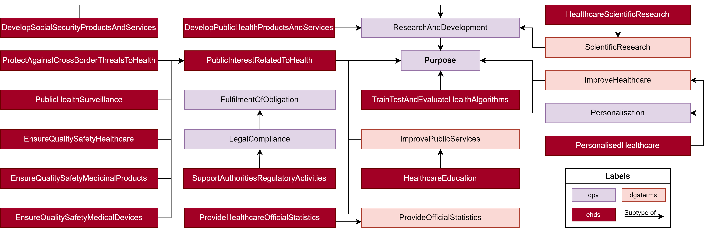
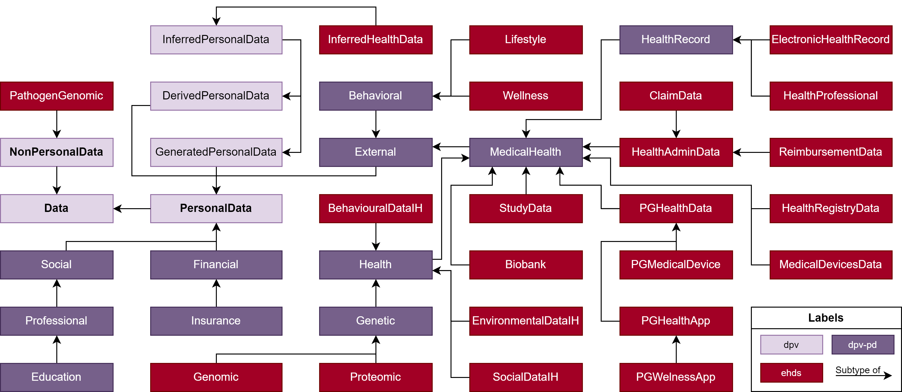

# Specifying Health Data Usage Policies for Legally-aware Data Spaces

In 2020, the European Union launched its *'strategy for data'* with the goal of promoting a people-centric market for data, services and AI systems in Europe, while respecting European personal data protection values and ensuring fair, trustworthy and transparent data access to all involved entities.
To further ensure this vision, a series of legislative measures were launched, among them the proposed Data Act - a proposal for fair access and use of industrial data -, the Data Governance Act (DGA) - a regulation for intermediation service providers, including *data altruism organisations* -, and the European Health Data Space (EHDS) - the first EU proposal for a regulation on a domain-specific data space.
This proposal urges individuals to take control of their electronic health data and provides a set of measures to ensure a consistent, trustworthy, and efficient secondary use of data for *'altruistic purposes'* such as improved healthcare services or innovative research on rare diseases.
In parallel, initiatives such as the International Data Spaces Association and Gaia-X have been gaining momentum by developing services and infrastructure for the creation of open, decentralised and interoperable data spaces.
In order to address EHDS's new requirements and promote interoperability between data spaces initiatives, this work investigates how to extend existing Semantic Web vocabularies to generate policies for the secondary use of health data, in particular for altruistic purposes, considering data minimisation and purpose limitation principles.
Additionally, we provide preliminary work on a vocabulary with taxonomies of purposes, health data types and data spaces entities and roles.

## Repository Contents

The repository contains the following work:

- [`./vocabulary-terms`](./vocabulary-terms) contains a spreadsheet with the vocabulary's classes and an RDF serialisation in Turtle.
- [`./examples`](./examples) contains a list of RDF examples that use the modelled classes to specify ODRL policies for EHDS data categories and purposes
- [`./img`](./img) contains diagrams of the modelled purposes and data categories, which are also showcased below.

-----------------------

This work is under review at the [36th International Conference on Legal Knowledge and Information Systems (JURIX 2023)](https://jurix23.maastrichtlawtech.eu/).

Work developed by:

[Beatriz Esteves](mailto:beatriz.gesteves@upm.es), Ontology Engineering Group, Universidad Politécnica de Madrid, Spain
